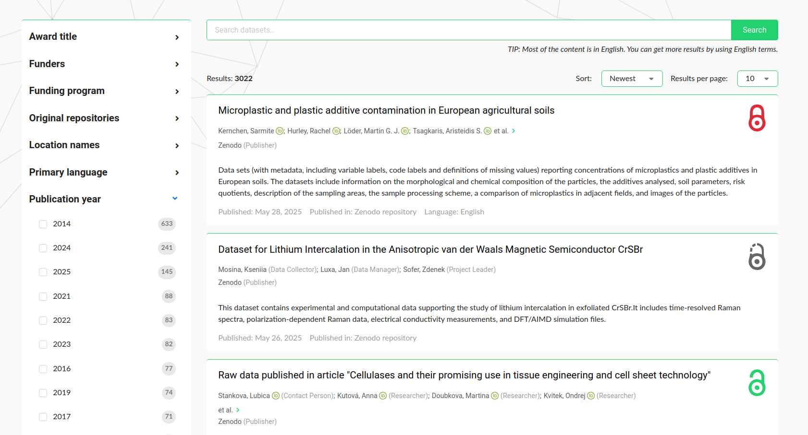

# Guide for repository communities

## Organization of the data and how to navigate it

National Metadata Directory contains information on research data related to Czech research in all science fields and disciplines. It covers datasets from natural sciences and engineering as well as from social sciences and humanities. It's search index concentrates metadata on datasets originating from source repositories. Metadata are description records on datasets, but not the data files, which you can access in the source repository by the link provided for each record. 

Here you will find how to search records, find what is the original repository of a dataset and how to go there for dataset files and possibly more detailed information or citation. 

National Metadata Directory focuses on datasets as a form of research data and does not contain records of scientific articles and scientific texts, which can be found in the document part of the National Repository.

### Search results

- Records matching your search criteria are organized into pages and listed in the right part of each page
- The search box shows your query which you can modify or change and below the search box there is number of results shown and choice of sorting criteria.
- On the left side of the page there are facets to refine your search, filled with options based on the occurences in metadata fields in current results.

### Record details

- In *record detail* view, the dataset persistent identifier is displayed on the right pane labelled as **Dataset Identifiers**, accompanied with the link to the original record.

See more on access icons in [Providing access](../statutoy-documents/providing-access.md).

- *Describe how to easily find information and advanced search options with respect to the needs of the repository communities.*
- *Describe how to cite repository records according to citation standards for scholarly publications.*
  
## Frequently asked questions

---
Find support contacts in [Contacts](../organizational-documents/management-and-contacts.md)

