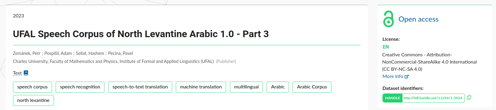

# Providing access to content

As National Metadata Directory aggregates records from other repositories and itself does not publish any datasets, the licences provided are presented from their source repositories. For the most part, datasets are provided on an open access basis, but some may be restricted for reasons of rights protection, commercial interest or protection of sensitive data. F.A.I.R principles further elaborates on the open access with „…as open as possible, as closed as necessary“. Access to record description (metadata) is always open, the access distinction are related to dataset files.

In search results, access conditions are simplified by a lock icon:

-  Green open lock signifies access is provided under Open Access principles.

-  Gray closed dotted lock signifies access is embargoed for certain time period, until it will be released under Open Access conditions.

-  Red closed lock signifies access is provided under different conditions, licence or negotiation with intellectual rights holders is required. The researchers can also licence the data under open licence while restricting access to files for login to original repository (i.e. identification) or other requirements. 

In record detail, the dataset specific licence is displayed on the right with "More info" link to the licence text. 

- *Describe what are the terms of access (intended use, attribution requirements) and what codes of conduct must be followed. Indicate ethical and
privacy provisions impact on the licenses.*
- *Provide disciplinary and ethical norms applied on sensitive data with disclosure risk. Indicate how is the access to such data limited and what guidance reposiory provides for responsible use of disclosive, or potentially disclosive data.*
- *Indicate how the repository monitors compliance with the terms of access, citations, and appropriate use of licenses.*
