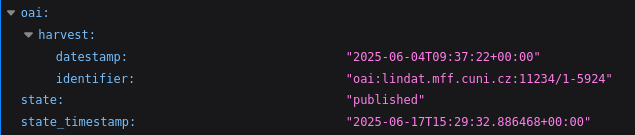

# Content understandability

# Quality of data and metadata

National Metadata Drectory harvests metadata in Czech Core Metadata Model (CCMM) format. All harvested records are formally validated for conformation to requirements of CCMM model.

Specification and documentation of this metadata model is available through [CCMM repository](https://github.com/techlib/CCMM), managed by National Technical Library. For metadata quections or comments on compatibility crosswalks from different formats, persistent identifiers, controlled vocabularies etc. [EOSC-CZ Metadata Working Group](https://www.eosc.cz/en/working-groups/metadata) can be contacted.

DataCite metadata model is also supported for additional processing of metadata from outside of National Repository Platform.

Please refer to source repositories of the records in question for the FAIR-ification, data and metadata quality procedures in place or dataset formats explanation.

# Where the records come from?

For harvest source identification, please use **Export in JSON format** function on *record detail* view and in downloaded file navigate to "oai" block, where the harvest URL ad date of record acquisition are displayed:
   


# Automated metadata discovery 

Machine actionable requests can be made to NMA via REST API or OAI-PMH.

Example API request to output all records in JSON:
```
curl  -d "Accept=application/json;charset=UTF-8" \
      -X GET \
      https://nma.eosc.cz/api/datasets/
```

for searching specific records you can use ```?q=``` parameter in API URL corresponding to the query used in NMA UI search box:
```
https://nma.eosc.cz/api/datasets/?q=
```

Working with result pagination and additional request formatting is described in [InvenioRDM REST API documentation](https://inveniordm.docs.cern.ch/reference/rest_api_drafts_records/).
