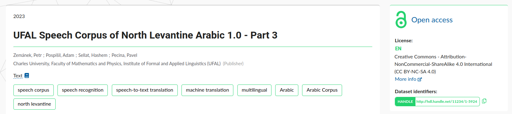

# Information management

This document describes requisities of information management, for general guide how to search and use citation see [Guide for communities](../guides/for-communities.md)

# Data discovery

General ways to discover the data in National Metadata Directory are search and browse interfaces as part of the web application. Results can be further refined by user interface facets for selecting certain metadata criteria.

All metadata are machine harvested from source repositories. Procedures ensuring quality of data, FAIR-ification, conformation to metadata standards are on behalf of source repositories and National Metadata Directory does not apply any additional data quality policies except necessary formal validation of harvesting metadata format. 

# Data identification

Persistent identifiers are assigned by source repositories, which can use different schemes. National Metadata Directory is PID scheme agnostic and can store and display records of any PID scheme, although currently present are two schemes: **DOI** and **Handle**. Persistent URLs are provided for every PID, linking to registered original record.

In *record detail* view, the dataset PID and scheme is displayed on the right pane labelled as **Dataset Identifiers**, accompanied with the link to the original record: 

# Machine readability

Please refer to [Content understandability](content-understandablity.md) for more information on technical details related to metadata and automated metadata discovery through NMA API or OAI-PMH.

